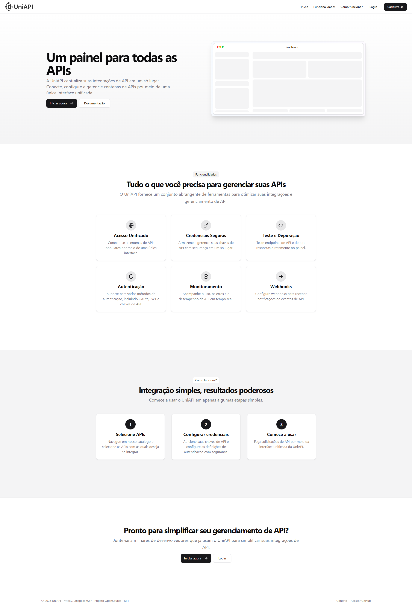

# UniAPI - Gateway de APIs Open Source


---

## Screenshot



---

## 🚧 Status do Projeto: **Em Construção**

O **UniAPI** é um projeto ambicioso que está atualmente em fase inicial de desenvolvimento. Este repositório foi criado para planejar e estruturar o gateway de APIs open source que centralizará o acesso a serviços externos. A ideia principal é permitir que desenvolvedores consumam múltiplas APIs através de um único endpoint, simplificando processos como autenticação, gerenciamento de limites de taxa e documentação.

---

## 🌟 Visão Geral

O **UniAPI** será uma solução open source que visa:

- **Simplificar Integrações**: Centralize o acesso a diversas APIs externas em um único endpoint.
- **Autenticação Unificada**: Use um único token JWT para acessar todas as APIs integradas.
- **Cache Inteligente**: Reduza o tempo de resposta e economize recursos com cache automático.
- **Monitoramento e Logs**: Forneça ferramentas para monitorar o uso das APIs e depurar problemas.
- **Extensibilidade**: Facilite a adição de novas APIs externas sem afetar o código existente.

---

## 📋 Funcionalidades Planejadas

Aqui estão algumas das funcionalidades que pretendemos implementar no futuro:

- **Roteamento Dinâmico**: Redirecionamento de solicitações para APIs externas com base em parâmetros configuráveis.
- **Autenticação Centralizada**: Gerenciamento simplificado de chaves de API e tokens.
- **Controle de Taxa (Rate Limiting)**: Implemente limites de uso para evitar abusos.
- **Documentação Automática**: Gere documentação unificada para todas as APIs integradas.
- **Interface de Administração**: Painel web para gerenciar APIs, chaves e logs.

---

## 🛠️ Como Contribuir

Embora o projeto ainda esteja em construção, estamos abertos a colaborações desde o início! Se você deseja participar do desenvolvimento, siga os passos abaixo:

1. **Fork o Repositório**:

   ```bash
   git clone https://github.com/luisotaviopilotto/uniapi.git
   cd uniapi
   ```

2. **Crie uma Branch para sua Contribuição**:

   ```bash
   git checkout -b feature/nome-da-feature
   ```

3. **Desenvolva e Commit suas Alterações**:

   ```bash
   git commit -m "Adiciona nova funcionalidade XYZ"
   ```

4. **Envie suas Alterações**:

   ```bash
   git push origin feature/nome-da-feature
   ```

5. **Abra um Pull Request**:
   Explique claramente o que sua contribuição adiciona ao projeto.

---

## 📅 Cronograma de Desenvolvimento

- **Fase 1**: Planejamento e definição da arquitetura básica (em andamento).
- **Fase 2**: Implementação do roteamento básico e autenticação unificada (próximos meses).
- **Fase 3**: Adição de funcionalidades avançadas (cache, rate limiting, etc.).
- **Fase 4**: Lançamento da versão beta para testes públicos.

---

## 📜 Licença

Este projeto será licenciado sob a [MIT License](LICENSE). Isso significa que você poderá usá-lo, modificá-lo e distribuí-lo livremente.

**Nota**: Este README será atualizado conforme o projeto avançar. Fique à vontade para acompanhar o progresso e contribuir!
